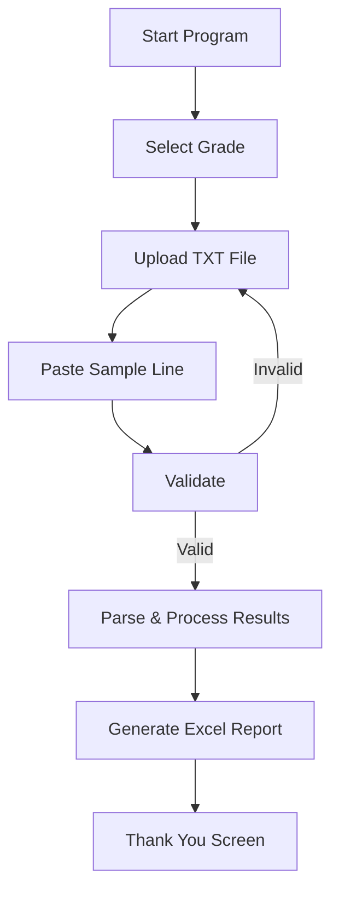

# 📘 **CBSE Result Soft**

<p align="center">
  
</p>

<p align="center">
  <b>A fully automated Grade 10 & Grade 12 CBSE Result Parser built using Python + Tkinter</b><br>
  Converts RAW CBSE TXT format → Clean Excel file with summary sheet, ranks, percentages, top-5, main-subjects & much more.
</p>

---

## 🚀 **Badges**

<p align="center">
  
  
  
  
  
  
</p>

---

# 🎞 **Preview**

> *(Replace `preview.jpg` with your actual file after uploading to GitHub)*

<p align="center">
  
</p>

---

# 🧩 **Project Overview**

This project reads **RAW CBSE result TXT files** (Grade 10 and 12) and generates a clean Excel file with:

✔ Auto-detected subject marks  
✔ Summary sheet  
✔ Ranks (Top 5 Rank, Main % Rank, Grade 12 Rank)  
✔ Highest/Lowest/Average  
✔ Distinction count  
✔ 100/100 count  
✔ Fully interactive Tkinter UI (Browse → Validate → Export Excel)  

---

# ⭐ Key Features

## 🧮 Result Parsing

* Extracts roll number, gender, student name
* Reads subject codes and marks line-by-line
* Supports Grade 10 and Grade 12

## 📊 Auto Reporting

* Generates:

  * Total marks
  * Percentage
  * Main subject %, Top 5 % (Class 10)
  * Rank calculations

## 📈 Excel Summary Sheet

The software creates a **Summary sheet** showing:

| Metric                     | Included |
| -------------------------- | -------- |
| Highest marks              | ✔        |
| Lowest marks               | ✔        |
| Average score              | ✔        |
| Count of distinction (≥75) | ✔        |
| Count of 100/100           | ✔        |

## 🎨 Simple GUI

* File picker dialog
* On-screen validation
* Step-wise windows (Upload → Validate → Generate → Final)

---

# 📚 Supported Classes & Subjects

## 📘 Class 10 Subject Map

| Code      | Subject        |
| --------- | -------------- |
| 184       | English        |
| 085       | Hindi          |
| 122       | Sanskrit       |
| 041 / 241 | Maths          |
| 086       | Science        |
| 087       | Social Science |
| 402       | IT             |

## 📗 Class 12 (Science / Commerce / Arts)

Examples:

| Code | Subject               |
| ---- | --------------------- |
| 301  | English               |
| 042  | Physics               |
| 043  | Chemistry             |
| 044  | Biology               |
| 055  | Accountancy           |
| 054  | Business Studies      |
| 030  | Economics             |
| 048  | Physical Education    |
| 065  | Informatics Practices |
| 027  | History               |
| 028  | Political Science     |
| 029  | Geography             |

---

# 🔄 Software Workflow

1️⃣ User opens software
2️⃣ Selects **Grade 10** or **Grade 12**
3️⃣ Uploads the `.txt` results file
4️⃣ Pastes a sample student record line
5️⃣ System validates:

* Correct class
* Correct subject codes
* Detects incorrect file uploads

6️⃣ User chooses output Excel file path
7️⃣ System generates:

* Main Excel Sheet
* Summary Sheet

8️⃣ Final “Thank You” screen displayed

---

# 🧰 Requirements

## 🔧 Python Packages

`requirements.txt`

```
pandas
openpyxl
tk
```

All other imports are included in Python standard library.

---

# ⚙️ Installation

## 📥 Clone the project

```bash
git clone https://github.com/abhijeetraj22/OMK_CBSE_RESULT.git
cd OMK_CBSE_RESULT
```

## 📦 Install dependencies

```bash
pip install -r requirements.txt
```

If Tkinter is missing (Linux):

```bash
sudo apt install python3-tk
```

## ▶ Run the software

```bash
python main.py
```

---

# 🧠 Step-By-Step Usage

## 🚀 Launch Program

User selects:

* **Grade 10 Program**
* **Grade 12 Program**

## 📁 Upload CBSE TXT File

Click **Choose File**, and pick the CBSE result file.

## ✍ Paste Sample Line

Paste one student record line from the TXT.

Example:

```
12345678 M RAMESH KUMAR 041 086 087 085
```

## 🔍 Click “Validate”

The system checks:

* Subject codes match correct class
* Format is valid
* Data detectable

If successful:

> “File validated successfully!”

## 💾 Generate Excel

Click:

✔ Save and Generate Excel

Select output filename:

```
result_10.xlsx
```

Software automatically creates:

* **Main result sheet**
* **Summary statistics sheet**
* **Rank & percentage columns**

## 🎉 Final Screen

User can exit or generate another file.

---

# 📊 Output Excel Format

## 📝 Sheet 1 – Student Result Table

Example columns:

| Roll | Name | ENG | MAT | SCI | SST | IT | Result |  Main % | Top 5 % | Main Rank | Top 5 Rank |
| ---- | ---- | --- | --- | --- | --- | -- | ------ | ------- | ------- | --------- | ---------- |

## 📈 Sheet 2 – Summary

| Subject | High | Low | Avg | Distinction | 100s |
| ------- | ---- | --- | --- | ----------- | ---- |

---

# 🖥 **Tech Stack**

| Component        | Technology            |
| ---------------- | --------------------- |
| GUI              | Tkinter               |
| Backend          | Python                |
| Excel Processing | Pandas + OpenPyXL     |
| Packaging        | PyInstaller           |
| OS Support       | Windows / Linux / Mac |

---

# 📂 **Project Structure**

```
CBSE_RESULT_SOFT/
│
├── Result_Soft.py
├── Result_Soft_ver_5.py
├── cbse_TNC_icon.ico
├── preview.gif
├── requirements.txt
└── README.md
```

---

# 📦 **Requirements Installation**

## 1️⃣ Install dependencies

```
pip install -r requirements.txt
```

### ✔ requirements.txt

```
pandas
openpyxl
tk
```

> `tk` is included in Python on Windows. If missing on Linux:

```
sudo apt install python3-tk
```

---

# ▶️ **How to Use**

### **Step 1 — Run the Software**

```
python main.py
```

### **Step 2 — Choose Version**

* Grade 10
* Grade 12

### **Step 3 — Upload RAW TXT File**

Click **Choose File** → Select CBSE `.txt` file.

### **Step 4 — Paste a Sample Student Line**

Copy 1 student record from your RAW TXT & paste.

### **Step 5 — Validate**

The system checks:

* Correct subject codes
* Correct grade selection
* Proper line format

### **Step 6 — Generate Excel**

Click:

```
Save and Generate Excel
```

Then select file name → Excel file is created with Summary sheet.

---

# 🎯 **UML Workflow Diagram**

## **ASCII Version** 

```
 ┌───────────────┐
 │ Start Program │
 └──────┬────────┘
        ▼
 ┌───────────────┐
 │ Select Grade  │
 └──────┬────────┘
        ▼
 ┌───────────────┐
 │ Upload TXT    │
 └──────┬────────┘
        ▼
 ┌───────────────┐
 │ Paste Sample  │
 └──────┬────────┘
        ▼
 ┌───────────────┐
 │ Validate File │
 └──────┬────────┘
  Valid ▼  ▲ Invalid
 ┌───────────────┐
 │ Parse Results │
 └──────┬────────┘
        ▼
 ┌───────────────┐
 │ Generate XLSX │
 └──────┬────────┘
        ▼
 ┌───────────────┐
 │ Thank You     │
 └───────────────┘
```

## Mermaid Diagram



---

# 📘 **Code Snippet Example**

```python
app = CBSEParserApp()
app.mainloop()
```

---

# 🏗 **Build Standalone EXE**

### 1️⃣ Install PyInstaller

```
pip install pyinstaller
```

### 2️⃣ Build EXE

```
pyinstaller --noconsole --onefile --icon=cbse_TNC_icon.ico main.py
```

EXE will be created in:

```
dist/main.exe
```

---

# 🤝 **Contributing**

Pull requests are welcome!
Please open an issue for:

* Feature requests
* Bug reports
* Enhancements

---

# 📜 **License**

This project is licensed under the **MIT License**.

---

# 💬 **Author**

**Abhijeet Raj**
✨ Dedicated to making CBSE result processing faster & automated.

---

# 🌐 Connect With Me

[](https://www.linkedin.com/in/rajabhijeet22/)
[](https://github.com/abhijeetraj22)
[](https://www.instagram.com/abhijeet_raj_/)
[](https://twitter.com/abhijeet_raj_/)


